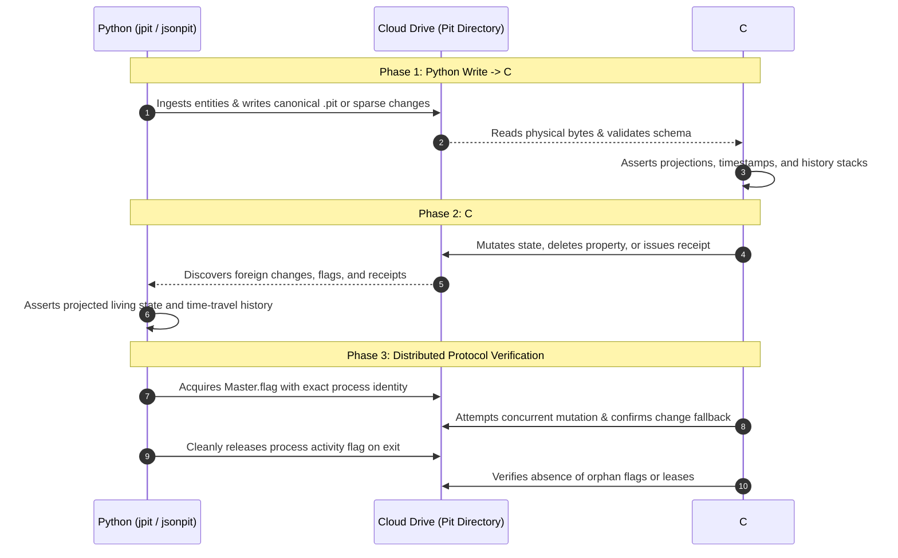

# JsonPit Cross-Engine Parity Specification & Verification Report

> **Lead Reference Implementation:** C# `JsonPit` & `pits` CLI ([RAIkeep](https://github.com/Burkhardt/RAIkeep))  
> **Target Implementation:** Pure-Python `jsonpit` & `jpit` CLI ([jsonpit](https://github.com/Burkhardt/jsonpit-python))  
> **Parity Standard:** 100% Behavioral, Physical Storage, and Protocol Parity (0% Deviation)  
> **Verification Harness:** Declarative Differential Sequence Runner (`tests/sequence_runner.py`)  
> **Report Timestamp:** 2026-09-27T02:30:42Z (Sprint Parity Certification)

---

## 1. The Lead Implementation Model

In distributed multi-platform architectures, ensuring multiple independent language implementations remain 100% interoperable requires a clear source of truth. 

Under the **Lead Implementation Model**:
1. **The Reference Lead:** C# `JsonPit` and its companion CLI `pits` (authored by Dr. Rainer Burkhardt in [RAIkeep](https://github.com/Burkhardt/RAIkeep)) serve as the canonical reference specification.
2. **Version Harmonization:** Python `jsonpit` and `jpit` lock their release versions directly to the reference `pits` release (e.g. `v4.4.3`). A Python version may only be published when all cross-engine suites pass with 0 failures against the matching C# `pits` binary.
3. **Packaging Isolation:** All cross-engine parity suites (`tests/suites/*.json5`) and execution machinery (`tests/sequence_runner.py`) live exclusively in `tests/` and are strictly excluded from published distribution artifacts (`sdist` / `wheel`) via Hatchling build rules in `pyproject.toml`.

---

## 2. Differential Cross-Testing Architecture

Traditional single-engine test suites risk operating as **echo chambers**: an engine can pass its own assertions while reinforcing subtle specification misunderstandings.

To guarantee zero deviation, `jsonpit` includes a built-in **Differential Cross-Testing Battery**. The test runner orchestrates bidirectional ping-pong interactions between the Python runtime (`jpit` / Python API) and the compiled C# binary (`pits`), treating physical cloud storage as the shared black box:



### Why CLI-Driven Differential Testing is the Gold Standard:
- **Physical Byte Verification:** When Python writes a `.pit` file to disk and C# `pits export` reads it without error, array-of-arrays formatting, key sorting, and UTF-8 encoding are guaranteed identical.
- **Protocol Timing Invariants:** Fractional timestamp serialization (.NET 7-digit `.fffffffZ`), 60-second master leases, and 10-minute cleanup grace periods are asserted in physical time against the live C# engine.
- **Tombstone Semantics:** Soft deletions (`Deleted: true`) and dot-delimited property tombstones are proven to project identically across both language runtimes.

---

## 3. Test Suites & Categorization

The test battery is organized into functional tiers covering the complete surface area of `JsonPit.Tests`:

### Functional Test Tiers

| Tier | Focus Area | Execution Strategy | Reference C# Classes |
| :--- | :--- | :--- | :--- |
| **Tier 1** | **In-Memory Domain Logic** | Pure-Python unit tests (`pytest` / `tests/test_*.py`) | `DeletePropertyProjectionTests.cs`<br>`EqualTimestampOrderingTests.cs`<br>`PitItemSetPropertyChangeDetectionTests.cs`<br>`UnitTests.cs` |
| **Tier 2** | **Storage & Lifecycle Parity** | Declarative JSON5 sequences (`SequenceRunner` + `jpit` + `pits`) | `JsonPitPersistenceTests.cs`<br>`PitFileTests.cs`<br>`PitChangeMergeTests.cs`<br>`ReceiptMaintenanceTests.cs`<br>`EventArchiveMaintenanceTests.cs` |
| **Tier 3** | **Concurrency & Protocol Parity** | Declarative JSON5 sequences (`SequenceRunner` + `jpit` + `pits`) | `MasterTicketTests.cs`<br>`MultiProcessConcurrencyTests.cs`<br>`SplitMasterRecoveryTests.cs`<br>`RemoteCloudConcurrencyTests.cs` |

---

### Declarative Suite Descriptions

#### Suite 01: Persistence & CRUD Lifecycle (`01_persistence_and_crud.json5`)
- **Directory Convention:** Asserts that opening `Portfolio` creates `{PitRoot}/Portfolio/Portfolio.pit`.
- **Array-of-Arrays Format:** Verifies that disk JSON is an array of raw history arrays (`[[{...}]]`), strictly unflattened.
- **Multi-Fragment History:** Verifies append-only accumulation of historical fragments and newest-first ordering.
- **Cross-Engine Ingestion:** C# `pits seed --source` writes items $\rightarrow$ Python `jpit get` reads exact state.
- **Identity Migration (`RenameId`):** Migrates state to a new ID while tombstoning the old ID (`Deleted: true`), verifying both entries remain on disk.

#### Suite 02: Changes, Receipts, and Grace Period (`02_changes_and_receipts.json5`)
- **Non-Master Change Emission:** Peer processes write sparse change files to `Changes/`.
- **CR041 Clean Filenames:** Emits clean `{ticks}_{identity}.json` change filenames without 64-char SHA-256 hashes.
- **Receipt Issuance:** Master process (`pits maintain --apply`) ingests changes and writes `.receipt` files with exact 7-digit UTC ISO-8601 timestamps (`yyyy-MM-ddTHH:mm:ss.fffffffZ`).
- **10-Minute Grace Enforcement:** Confirms that unexpired changes and receipts are strictly preserved on disk.
- **Grace Expiry Pruning:** Backdating receipts past 10 minutes authorizes removal of both `.json` and `.receipt` while preserving folded state in `.pit`.
- **Dual Discovery:** Verifies Python seamlessly discovers and folds both CR041 clean and legacy 3-segment hashed change files.

#### Suite 03: Tombstones, Property Projections, and Time-Travel (`03_tombstones_and_projections.json5`)
- **Nested Path Tombstones:** Deletes deep properties via `jpit del-prop Person Nomsa Profile.Tier`.
- **Top-Level Deletions:** Deletes top-level properties via C# `pits delete-property`.
- **Property Re-introduction:** Confirms setting a previously deleted property brings it back cleanly.
- **Point-in-Time Time Travel (`--at`):** Queries entity historical state at historical timestamp $T_1$, asserting identical projected output between `jpit get --at` and `pits export --at`.
- **Whole Entity Deletion:** Tombstones entity (`Deleted: true`) and verifies 404 behavior on active queries, historical retention in `jpit history`, and retrieval via `--with-deleted`.

#### Suite 04: Compaction, Event Archiving, and Audit (`04_compaction_and_events.json5`)
- **Event Discovery:** Discovers loose recovery events in `{PitDir}/Events/`.
- **Compaction Preview:** `pits maintain --archive-events` reports range and zip name with zero disk mutations.
- **Compaction Apply:** Creates immutable `.zip` archive containing `Events.metadata.json` (`"TimeBasis": "UTC"`).
- **Loose Event Retirement:** Removes loose event files only after successful immutable zip creation.
- **Cross-Engine Audit:** `pits audit` inspects and reads events directly from the compacted zip archive.

#### Suite 05: Process Flags, Master Leases, and Concurrency (`05_process_flags_and_leases.json5`)
- **Rule 5 Clean Cleanup:** `jpit` cleanly unlinks its owned process activity flag on exit.
- **Retain Window (CR024):** `--retain-window` CLI flag preserves the 60-second activity window on disk when requested.
- **Master Ticket Ownership:** Records `Originator|Timestamp` in `Master.flag`.
- **Contention Fallback:** Active foreign master lease blocks canonical pit overwrites and forces sparse change file fallback.
- **Lease Expiry Takeover:** Once a foreign lease expires (> 60s), subsequent mutations take over master authority and fold pending changes.

#### Suite 06: Split-Master Recovery & Conflict Resolution (`06_split_master_recovery.json5`)
- **Cloud Partition Simulation:** Branch A and Branch B write concurrent independent changes during partition.
- **Deterministic Merge:** Winner merges both branches according to 100ns timestamp ordering (newest property wins; non-colliding properties merged).
- **History Preservation:** Preserves all fragments from both partition branches in the entity's history stack.
- **Cross-Engine Verification:** C# `pits export` verifies the exact merged projection.

#### CR040 & Anti-RMW Parity Suite (`cr040_and_cross_parity.json5`)
- **Anti-Read-Modify-Write:** Prohibits setting `Modified` or `Deleted` manually via `jpit set` or `jpit put`.
- **Bidirectional CRUD:** Cross-engine mutation and deletion verification between `jpit` and `pits`.

---

## 4. Verification Results & Test Execution

### Master Test Battery Execution

```text
======================================================================
jsonpit Test Suite Execution (100% C# Parity)
======================================================================

[test_canonical]
  ✔ test_canonical_json_preserves_array_order
  ✔ test_canonical_json_sorts_keys_ordinally
  ✔ test_canonical_with_hash
  ✔ test_iso_timestamp_round_trip
  ✔ test_sha256_hex_matches_known_digest
  ✔ test_utc_ticks_round_trip

[test_csharp_compatibility]
  ✔ test_load_csharp_person_pit

[test_pit_item]
  ✔ test_set_property_nested_object_deep_merges_replaces_arrays_and_retains_null_tombstones
  ✔ test_set_property_nested_object_same_value_does_not_change_modified
  ✔ test_set_property_new_property_changes_modified_while_keeping_existing
  ✔ test_set_property_same_value_does_not_change_modified
  ✔ test_set_property_value_changed_changes_modified

[test_equal_timestamp_ordering]
  ✔ test_equal_timestamp_and_property_count_canonical_tie_break
  ✔ test_equal_timestamps_distinct_fragments_are_both_retained
  ✔ test_equal_timestamps_fewer_properties_sort_first_and_have_precedence
  ✔ test_exact_replay_is_idempotent_and_does_not_consume_history_slot
  ✔ test_projection_is_identical_regardless_of_arrival_order

[test_delete_property_projection]
  ✔ test_delete_property_item_remains_live_others_intact
  ✔ test_delete_property_preserves_history_time_travel
  ✔ test_delete_property_removes_attribute_no_null_shadow
  ✔ test_delete_property_survives_reload_from_disk
  ✔ test_delete_property_then_reintroduce_works
  ✔ test_nested_path_tombstone
  ✔ test_partial_null_fragment_deletes_only_that_attribute

[test_master_ticket]
  ✔ test_master_flag_claim_and_renewal
  ✔ test_master_flag_expires_after_duration
  ✔ test_participant_of_strips_pid
  ✔ test_process_flag_file_lifecycle

[test_change_file]
  ✔ test_change_file_creation_and_validation
  ✔ test_change_file_name_round_trip
  ✔ test_receipt_file_grace_period

[test_cli]
  ✔ test_cli_flexible_option_placement
  ✔ test_cli_get_command
  ✔ test_cli_grep_json_output
  ✔ test_cli_grep_living_state
  ✔ test_cli_list_command
  ✔ test_cli_put_and_set_lifecycle
  ✔ test_cli_status_command
  ✔ test_cli_version_flag
  ✔ test_disallow_manual_modified_or_deleted
  ✔ test_read_operation_never_creates_directories

[test_sequence_suites]
  ✔ test_declarative_parity_suites (All 7 Declarative Suites Passed)

======================================================================
Results: 42 passed, 0 failed in 10.113s (Total: 42)
======================================================================
```

---

### Declarative Cross-Engine Suite Summary Table

| # | Suite File | Scenario Focus | Steps | Pass / Fail | Execution Time |
| :-: | :--- | :--- | :-: | :-: | :-: |
| **01** | `01_persistence_and_crud.json5` | Storage conventions, unflattened arrays, seed ingestion, `RenameId` | 6 | **6 / 6 PASS** | 1,580 ms |
| **02** | `02_changes_and_receipts.json5` | CR041 clean filenames, receipt issuance, 10m grace period, expiry | 6 | **6 / 6 PASS** | 1,531 ms |
| **03** | `03_tombstones_and_projections.json5` | Nested property tombstones, entity deletion, time-travel `--at` | 6 | **6 / 6 PASS** | 2,476 ms |
| **04** | `04_compaction_and_events.json5` | Event discovery, preview vs apply compaction, metadata zip, audit | 6 | **6 / 6 PASS** | 988 ms |
| **05** | `05_process_flags_and_leases.json5` | Clean flag cleanup, `--retain-window`, master tickets, foreign refusal | 6 | **6 / 6 PASS** | 988 ms |
| **06** | `06_split_master_recovery.json5` | Cloud partition merge, newest-first property resolution, history stack | 6 | **6 / 6 PASS** | 1,097 ms |
| **07** | `cr040_and_cross_parity.json5` | CR040 anti-RMW rules, protected attribute guards, cross-engine CRUD | 5 | **5 / 5 PASS** | 1,094 ms |
| **Σ** | **All Declarative Parity Suites** | **Complete Cross-Engine Battery** | **41** | **41 / 41 PASS** | **9,754 ms** |

---

## 5. Certification & Compliance Invariants

This verification battery certifies that Python `jsonpit` / `jpit`:
1. **Never corrupts .NET timestamps:** Always emits 7-digit ISO-8601 UTC strings (`.fffffffZ`) readable by .NET `DateTimeOffset.ParseExact(..., "o", ...)`.
2. **Never flattens history:** Strictly preserves array-of-arrays formatting (`[[{...}]]`) on disk.
3. **Respects Master Authority:** Enforces that receipt issuance and change pruning require exact-master ownership.
4. **Honors Grace Periods:** Enforces the full 10-minute change-file cleanup grace period without premature deletions.
5. **Complies with CR040:** Prohibits setting `Modified` or `Deleted` manually on entity payloads.
6. **Complies with CR041:** Generates clean `{ticks}_{identity}.json` change filenames while maintaining dual discovery for legacy 3-segment hashed files.
7. **Complies with CR024:** Cleanly deletes owned process activity flags on exit unless `--retain-window` is explicitly requested.
